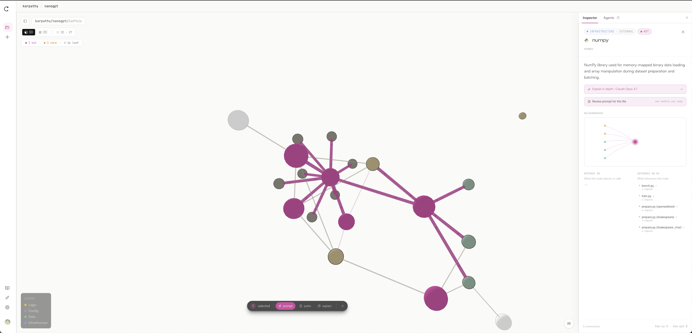

<div align="center">

<svg width="56" height="56" viewBox="0 0 24 24" fill="none" stroke="currentColor" stroke-width="1.75" stroke-linecap="round" xmlns="http://www.w3.org/2000/svg">
  <path d="M18 5.2 A 8.5 8.5 0 1 0 18 18.8"/>
  <circle cx="18" cy="18.8" r="1.9" fill="currentColor" stroke="none"/>
  <circle cx="18" cy="5.2" r="1.9"/>
</svg>

# Causalist

**A causal graph layer for any codebase — for humans, and for the agents writing code on your behalf.**

[](https://www.npmjs.com/package/causalist-cli)
[](https://www.npmjs.com/package/causalist-mcp)
[](https://claude.com/claude-code)
[](https://anthropic.com)
[](LICENSE)

</div>

---

<p align="center">
  
</p>
<p align="center"><sub><i>Karpathy's nanoGPT mapped in ~40s. Magenta nodes are top-tier by fan-in. The right panel shows what each file does and what it depends on. NumPy is highlighted as an external dependency.</i></sub></p>

---

## Why Causalist exists

A coding agent that opens one file at a time will get small things wrong, repeatedly. Edit a function, miss three call sites, watch tests fail, grep, retry. Most of the agent's session ends up spent rediscovering the same structural facts.

Humans dropped into a new repo do the same thing — burn an afternoon clicking through folders before they can make a sensible change.

Causalist replaces that rediscovery loop with a **causal graph of the codebase**: every file as a node, every import / call / read / write as a typed edge, classified by layer (api, ui, logic, data, infra, config, test). Built once by four Claude Opus 4.7 agents in 30–60 seconds. AST-verified with `@babel/parser` for JS/TS and a Python import scan, so every edge is stamped `verified: true | false` — auditable, not hallucinated.

The graph then becomes a substrate that two audiences read in different ways:

- **Humans** see it in the [browser viewer](https://causalist.xyz) — a 3D force-directed layout where they can scope a question to a few nodes, follow imports, and ask the Oracle agent "what breaks if I delete this?" or "what does this do?"
- **Coding agents** consume it through 11 typed graph-query tools — `blast_radius`, `find_path`, `get_neighbors`, `affected_tests`, etc. — exposed as both a CLI (preferred for Claude Code) and a Model Context Protocol server (Cursor, Claude.ai web, anything without a shell).

Either path, the agent can ask "what does this change break?" *before* changing anything — a verification loop for cross-file reasoning, not after-the-fact test failure.

## How it works

```
GitHub URL
    │
    ▼
┌───────────────┐    ┌────────────────┐    ┌──────────────┐    ┌─────────┐
│  Structure    │───▶│  Dependency    │───▶│   Oracle     │───▶│  Graph  │
│  (file tree   │ ┌─▶│  (edges)       │    │  (synthesis  │    │   +     │
│   + layers)   │ │  ├────────────────┤    │   + QA)      │    │  AST    │
└───────────────┘ │  │  Semantic      │    │              │    │ verify  │
                  └─▶│  (summaries)   │    │              │    │         │
                     └────────────────┘    └──────────────┘    └─────────┘

       step 1            step 2 (parallel)        step 3        finalize
```

Structure runs first because the next two stages need its node manifest. Dependency and Semantic then run in parallel against that manifest. Oracle merges, deduplicates, and ships a final `CausalGraph`. Each agent emits JSONL — one node / edge / summary per line — so the browser paints the live force graph as the build progresses.

Per-agent model selection lets you trade quality for speed (Opus 4.7 default; Sonnet 4.6 / Haiku 4.5 selectable per agent in the New Project modal).

## The three surfaces

| Surface         | Audience                                                | Install                                                                          |
| --------------- | ------------------------------------------------------- | -------------------------------------------------------------------------------- |
| **Web viewer**  | Humans — exploration, code review, onboarding           | Open [causalist.xyz](https://causalist.xyz)                                      |
| **CLI + Skill** | Claude Code (preferred — code execution beats tool JSON) | `npm i -g causalist-cli && causalist install`                                    |
| **MCP server**  | Cursor, Claude.ai web, IDEs without a shell             | `claude mcp add causalist -- npx -y causalist-mcp@latest --session <pair-code>`  |

Anthropic's [Code Execution with MCP](https://www.anthropic.com/engineering/code-execution-with-mcp) writeup makes the case for shipping CLIs over tool-call JSON for coding agents — tool descriptions don't bloat context, only the slice the agent actually queries comes back. We ship both because some clients can't shell out.

## CLI — `causalist`

The CLI is the primary surface for Claude Code. One install drops a [Claude Code Skill](https://code.claude.com/docs/en/skills) into `~/.claude/skills/causalist/` so the agent auto-discovers when each subcommand applies.

```bash
npm install -g causalist-cli
causalist pair <code>           # one-time pair from causalist.xyz/pair
causalist install               # install the SKILL.md into ~/.claude/skills/
causalist project create owner/repo   # build a graph end-to-end and upload it
```

After install, Claude Code can call any of the 11 graph-query subcommands directly. Output is JSON when piped, plain text in a TTY, exit code 0 on success / 1 on `ok: false` / 2 on a fatal error.

| Command                       | What it answers                                                                  |
| ----------------------------- | -------------------------------------------------------------------------------- |
| `causalist node <id>`         | Node metadata, layer, summary                                                    |
| `causalist neighbors <id>`    | In / out edges with `verified` flag                                              |
| `causalist path <a> <b>`      | Shortest causal path between two nodes                                           |
| `causalist blast <id>`        | Reverse-reachable set — what transitively depends on a node                      |
| `causalist tests <ids…>`      | "3 tests not 300" — tests reachable from changed files                           |
| `causalist writers <id>`      | Every node that writes to a target (security / audit query)                      |
| `causalist similar <id>`      | Structurally similar nodes ("add a thing like this")                             |
| `causalist topo <ids…>`       | Topological layering of a subgraph (build order)                                 |
| `causalist layer <name>`      | List nodes in a semantic layer                                                   |
| `causalist verify <a> <b>`    | Confirm an edge exists                                                           |
| `causalist info`              | Capabilities manifest with active session                                        |

Full guide: `causalist --help` after install, or read the [Skill](packages/cli/skills/causalist/SKILL.md) directly.

## MCP server — `causalist-mcp`

For clients that don't have a shell (Cursor, Claude.ai web, JetBrains), the same 11 tools are exposed over stdio via Model Context Protocol.

```bash
# pair the browser at causalist.xyz/pair, then:
claude mcp add causalist -- npx -y causalist-mcp@latest --session <pair-code>
```

The MCP server adds one tool the CLI doesn't have: `create_project`, which pushes a freshly-built graph from the agent into the paired browser session — so when Claude is iterating in your editor, the graph viewer updates live in another tab.

## The web viewer

Live at **[causalist.xyz](https://causalist.xyz)**. Three pre-rendered demo graphs load instantly:

- `/app/preview/causalist` — the app, mapping itself
- `/app/preview/next-js` — a curated slice of `vercel/next.js`
- `/app/preview/flask` — `pallets/flask`

To map your own repo, paste a GitHub URL on `/app`. Add your Anthropic key in Settings (sent as a Bearer header to `/api/analyze`, never persisted server-side). Pick which agents to run in the build modal, then watch the four agents draw the graph in real time.

The viewer is a 3D force-directed canvas built on Vasco Asturiano's [3d-force-graph](https://github.com/vasturiano/3d-force-graph) and [react-force-graph](https://github.com/vasturiano/react-force-graph). 2D mode toggle for high-density inspection. Selection scopes the post-build Ask agent (a [Claude Managed Agent](https://docs.claude.com/en/api/managed-agents) with the same 11 graph tools as custom tools) to whatever you've highlighted.

## Develop

```bash
git clone https://github.com/daxaur/causalist.git
cd causalist
npm install
npm run dev -- --port 4141
```

Required env (`.env.local`):
- `GITHUB_OAUTH_CLIENT_ID` / `GITHUB_OAUTH_CLIENT_SECRET` — for GitHub sign-in
- `SUPABASE_URL` / `SUPABASE_SERVICE_KEY` — graph + API key persistence (optional; falls back to in-memory)

The `/api/analyze` endpoint takes the user's Anthropic key as `Authorization: Bearer …` and never persists it. Per-user data (graphs, API keys) is keyed by GitHub user id.

## Stack

- **Web** — Next.js 16 (App Router, async params, Turbopack), TypeScript, Tailwind v4, shadcn/ui
- **Viewer** — [`react-force-graph-3d`](https://github.com/vasturiano/react-force-graph) / `-2d` (built on [3d-force-graph](https://github.com/vasturiano/3d-force-graph)) + Three.js + d3-force-3d
- **Agents** — `@anthropic-ai/sdk` calling Claude Opus 4.7 (Sonnet 4.6 / Haiku 4.5 selectable per builder agent); post-build Ask uses Claude Managed Agents with the 11 graph-query tools as custom tools
- **Verification** — `@babel/parser` for JS/TS, line-scan AST for Python
- **Ingestion** — `@octokit/rest` (GitHub API, scoped to `repo` for private repos when the user signs in)
- **Persistence** — Supabase (rows keyed `user-<github-id>-<owner>-<repo>`) with IndexedDB browser cache
- **CLI / MCP** — Node 20+, distributed as `causalist-cli` and `causalist-mcp` on npm
- **Type / icons** — Clash Display + Satoshi + JetBrains Mono, Phosphor (duotone), Devicon for language logos
- **Hosting** — Vercel (web), npm registry (packages)

## Documentation

In-app at [`causalist.xyz/docs`](https://causalist.xyz/docs):
- **Foundations** — why a coding agent needs a real graph (HippoRAG, RepoGraph, LocAgent citations)
- **Graph schema** — semantic layers, edge kinds, AST verification, importance tiers
- **Pipeline** — the four-agent flow in detail
- **Graph retrieval** — how Claude reads the graph through the 11 tools
- **Integrations** — CLI / Skill, MCP, live streaming, plan-mode agent runs

## License

MIT.

Claude and Anthropic are trademarks of Anthropic PBC. This project is independent and unaffiliated.
